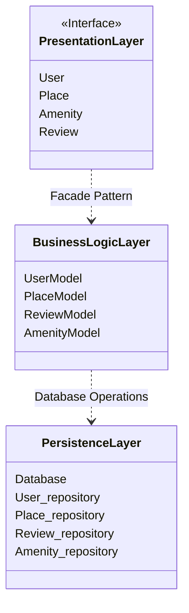
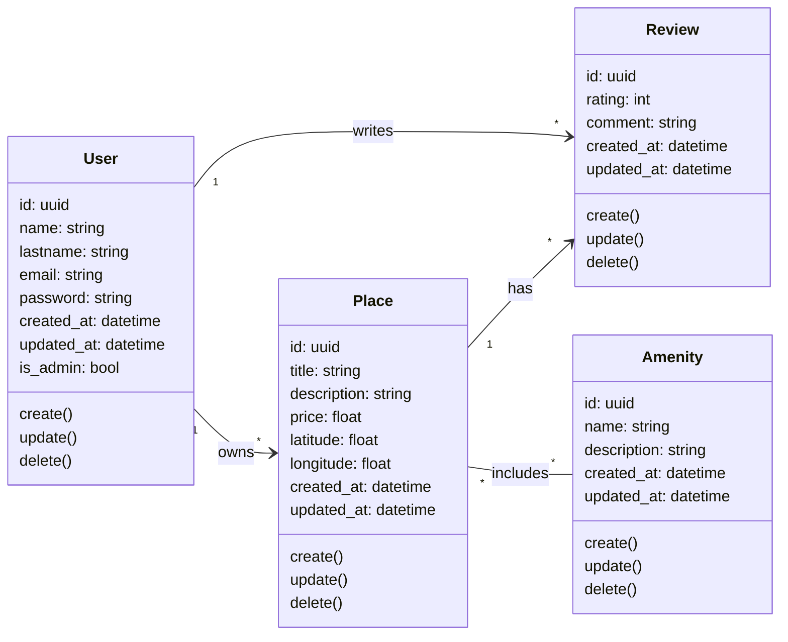
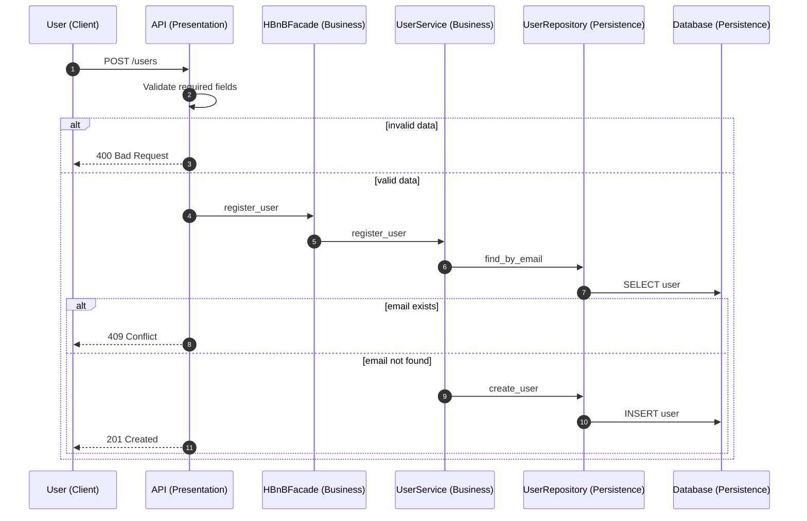
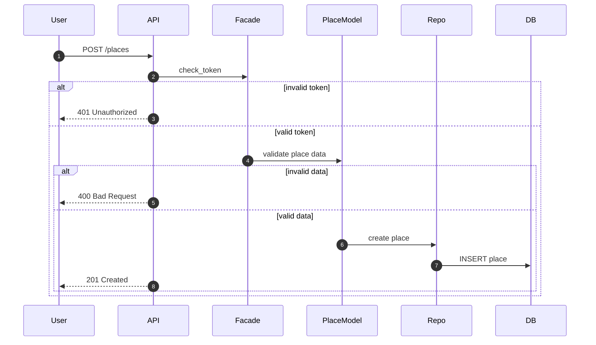
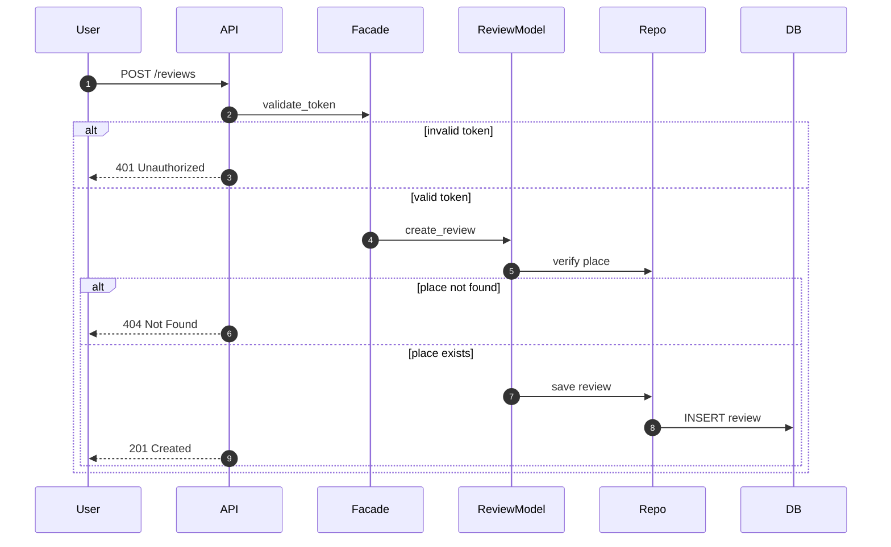
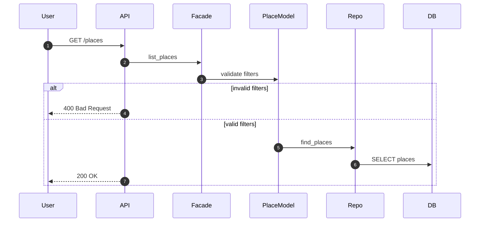

# HBnB Evolution – Technical Documentation  
## Part 1: Architecture and Design

---

## 1. Introduction

HBnB Evolution is a simplified AirBnB-like application designed to manage users, places, reviews, and amenities. The application allows users to register and manage their profiles, create and manage place listings, submit reviews for places, and retrieve a list of available places based on search criteria.

The purpose of this technical document is to compile and explain the UML diagrams produced during Part 1 of the project. It serves as a technical blueprint that describes the architecture, the business logic design, and the interaction flows between system components. This document is intended to guide the implementation phases of the HBnB Evolution application and to provide a clear reference for understanding the system’s structure and behavior.

This document includes:
- A high-level overview of the system architecture  
- A detailed description of the Business Logic layer and its entities  
- Sequence diagrams illustrating the main API interaction flows  

---

## 2. High-Level Architecture

### 2.1 Layered Architecture Overview

HBnB Evolution follows a **three-layer architecture**:

#### Presentation Layer
This layer exposes the API endpoints through which clients interact with the system. It receives requests, forwards them to the Business Logic layer, and returns appropriate responses.

#### Business Logic Layer
This layer contains the core logic of the application. It validates input data, applies business rules, manages entity lifecycles, and coordinates interactions with the persistence layer.

#### Persistence Layer
This layer is responsible for storing and retrieving data from the database using repository components.

This layered structure ensures a clear separation of responsibilities and improves maintainability and clarity.

---

### 2.2 Facade Pattern

Communication between the Presentation Layer and the Business Logic Layer is handled using a **Facade pattern**.

The Facade:
- Acts as a single entry point for API calls  
- Centralizes access to business logic  
- Prevents direct interaction between the API and persistence components  

This design simplifies the Presentation Layer and helps keep business logic isolated and consistent.

---

### 2.3 High-Level Package Diagram

**Explanatory Notes**

- This diagram illustrates the overall layered architecture of the HBnB Evolution application, showing how responsibilities are separated across the Presentation, Business Logic, and Persistence layers.
- The Presentation Layer exposes API endpoints and interacts with the Business Logic Layer exclusively through a Facade, which acts as a unified entry point.
- The Business Logic Layer contains the core application logic and coordinates operations between entities without direct knowledge of database implementation details.
- The Persistence Layer is responsible for data storage and retrieval, providing access to the database through repository components.
- The use of a Facade pattern reduces coupling between layers and ensures a clear and controlled flow of data throughout the system.

---

## 3. Business Logic Layer
## 3.1 Overview
The Business Logic layer defines the main entities of the application and the relationships between them. It is responsible for enforcing business rules and managing entity lifecycles.

All entities:

- Are uniquely identified by a UUID

- Store creation and update timestamps

- Expose basic lifecycle operations (create, update, delete)

---

## 3.2 Core Entities

### User
Represents a system user.

#### Key attributes

- id (uuid)

- name

- lastname

- email

- password

- created_at

- updated_at

- is_admin

A user can own places and write reviews.

---

### Place
Represents a property listed by a user.

#### Key attributes

- id (uuid)

- title

- description

- price

- latitude

- longitude

- created_at

- updated_at

A place belongs to a single user and can include amenities and receive reviews.

---

### Review
Represents feedback left by a user for a place.

#### Key attributes

- id (uuid)

- rating

- comment

- created_at

- updated_at

A review is associated with one user and one place.

---

### Amenity
Represents a feature or service associated with a place.

#### Key attributes

- id (uuid)

- name

- description

- created_at

- updated_at

An amenity can be associated with multiple places.

---

### 3.3 Business Logic Class Diagram

**Explanatory Notes**

- This diagram represents the core entities of the Business Logic layer and the relationships between them.
- Relationships between entities define ownership and responsibility, ensuring that places and reviews are always associated with a specific user.
- The association between places and amenities allows multiple amenities to be linked to multiple places, reflecting flexible feature assignment.
- UUIDs are used to uniquely identify each entity, enabling reliable referencing and interaction across the system.
- Timestamps (`created_at` and `updated_at`) record when entities are created and modified, supporting traceability and audit requirements.
- Each entity exposes basic lifecycle operations (create, update, delete), which are managed within the Business Logic layer.

---

## 4. API Interaction Flow
This section presents the sequence diagrams for the main API calls. Each diagram illustrates the interaction between the Presentation, Business Logic, and Persistence layers, as well as the flow of information through the system.

---

### 4.1 User Registration
#### Purpose
Allows a new user to register an account.

**Explanation**

- This sequence diagram describes the process of user registration from the initial API request to data persistence.
- The Presentation Layer first validates the presence of required fields before delegating the operation to the Business Logic layer.
- The Business Logic layer checks for email uniqueness to prevent duplicate accounts.
- If the email is available, a new user is created with a unique identifier and timestamps.
- The Persistence Layer stores the user data and confirms successful creation.
- Error scenarios such as invalid input data or existing email addresses are handled explicitly to ensure consistent responses.

---

### 4.2 Place Creation
#### Purpose
Allows an authenticated user to create a place listing.

**Explanation**

- This sequence diagram illustrates the creation of a place by an authenticated user.
- The request begins with authentication validation to ensure that only authorized users can create place listings.
- The Business Logic layer validates the place data to ensure all required attributes are provided and correctly formatted.
- Once validation is successful, the place is created and associated with the authenticated user.
- The Persistence Layer stores the place data and confirms successful insertion.
- Validation and authorization errors are handled early to prevent invalid data from being persisted.

---

### 4.3 Review Submission
#### Purpose
Allows a user to submit a review for a place.

**Explanation**

- This sequence diagram represents the process of submitting a review for a place.
- The system first validates the user’s authentication token to ensure the request is authorized.
- The Business Logic layer verifies that the referenced place exists before allowing review creation.
- Review data is validated to ensure it meets the required format and constraints.
- Once validated, the review is created with timestamps and persisted in the database.
- Error cases such as invalid authentication or non-existent places are handled explicitly.

---

### 4.4 Fetching a List of Places
#### Purpose
Retrieves a list of places matching search criteria.

**Explanation**

- This sequence diagram shows how a list of places is retrieved based on search criteria.
- The Presentation Layer forwards query parameters to the Business Logic layer for validation.
- Invalid filters are rejected early to avoid unnecessary database queries.
- When filters are valid, the Persistence Layer is queried to retrieve matching places.
- The system returns a list of places, which may be empty if no results match the criteria.
- This flow ensures efficient filtering while maintaining a clear separation of responsibilities between layers.

---

### About This Work
Created by Joan Faroux, Morgane Abbattista, Bengin Uzun
Holberton School Project – Part 1
