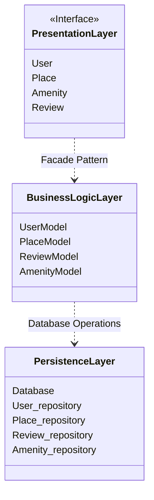
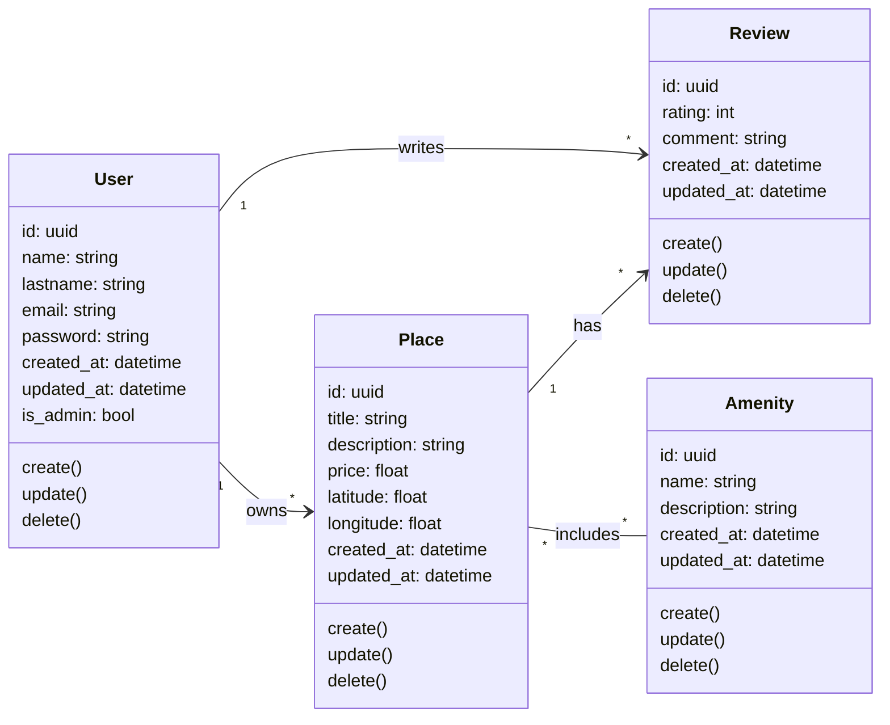
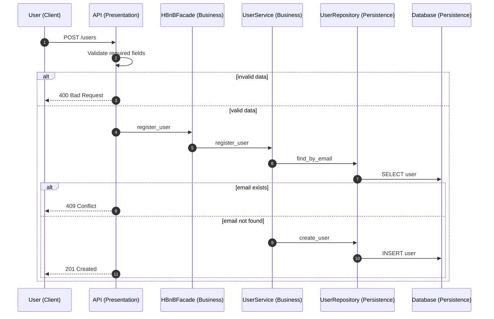
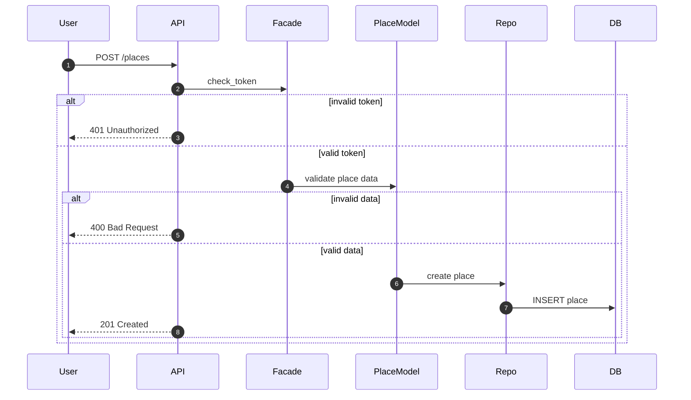
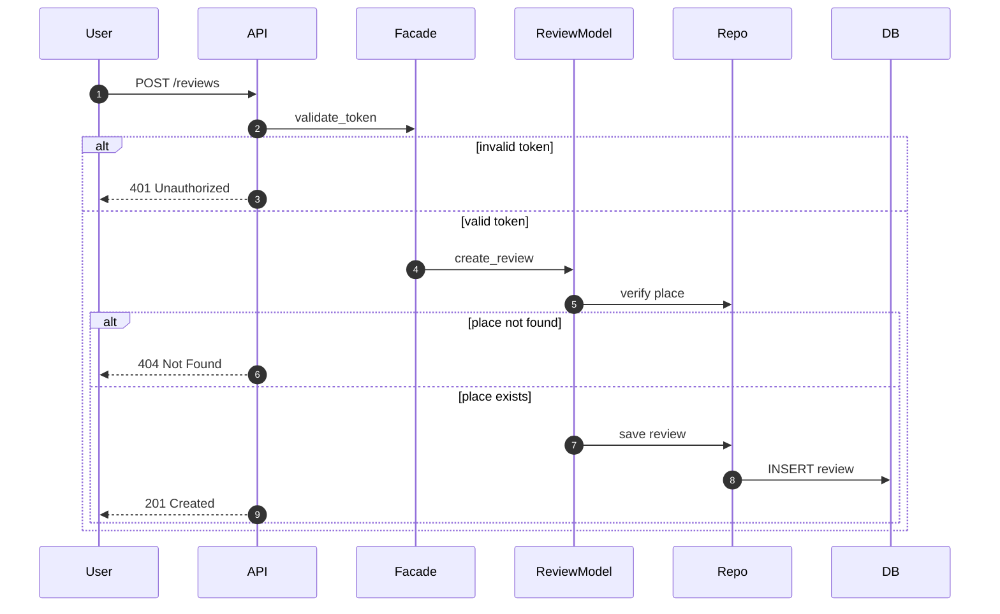
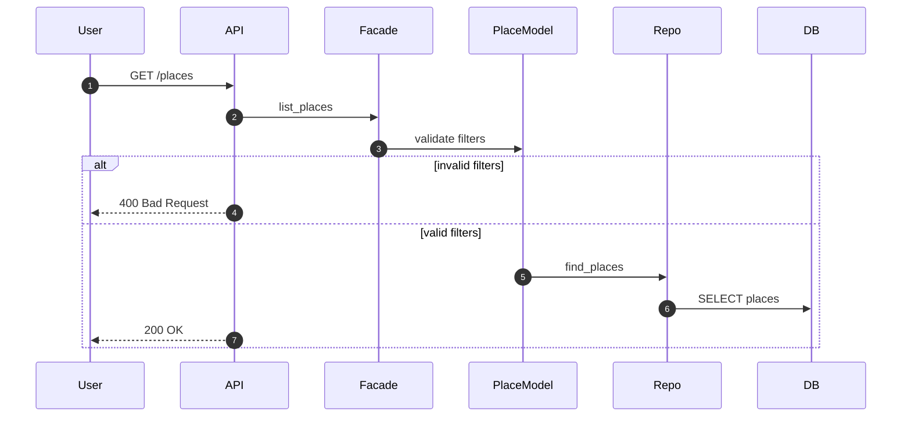

# HBnB Evolution – Technical Documentation  
## Part 1: Architecture and Design

---

## 1. Introduction

HBnB Evolution is a simplified AirBnB-like application designed to manage users, places, reviews, and amenities. The application allows users to register and manage their profiles, create and manage place listings, submit reviews for places, and retrieve a list of available places based on search criteria.

The purpose of this technical document is to compile and explain the UML diagrams produced during Part 1 of the project. It serves as a technical blueprint that describes the architecture, the business logic design, and the interaction flows between system components. This document is intended to guide the implementation phases of the HBnB Evolution application and to provide a clear reference for understanding the system’s structure and behavior.

This document includes:
- A high-level overview of the system architecture  
- A detailed description of the Business Logic layer and its entities  
- Sequence diagrams illustrating the main API interaction flows  

---

## 2. High-Level Architecture

### 2.1 Layered Architecture Overview

HBnB Evolution follows a **three-layer architecture**:

#### Presentation Layer
This layer exposes the API endpoints through which clients interact with the system. It receives requests, forwards them to the Business Logic layer, and returns appropriate responses.

#### Business Logic Layer
This layer contains the core logic of the application. It validates input data, applies business rules, manages entity lifecycles, and coordinates interactions with the persistence layer.

#### Persistence Layer
This layer is responsible for storing and retrieving data from the database using repository components.

This layered structure ensures a clear separation of responsibilities and improves maintainability and clarity.

---

### 2.2 Facade Pattern

Communication between the Presentation Layer and the Business Logic Layer is handled using a **Facade pattern**.

The Facade:
- Acts as a single entry point for API calls  
- Centralizes access to business logic  
- Prevents direct interaction between the API and persistence components  

This design simplifies the Presentation Layer and helps keep business logic isolated and consistent.

---

### 2.3 High-Level Package Diagram

### Explanatory Notes

- The Presentation Layer depends only on the Business Logic Layer through the Facade.

- Business logic is isolated from database concerns.

- The Persistence Layer provides database access through repositories.

## 3. Business Logic Layer
## 3.1 Overview
The Business Logic layer defines the main entities of the application and the relationships between them. It is responsible for enforcing business rules and managing entity lifecycles.

All entities:

- Are uniquely identified by a UUID

- Store creation and update timestamps

- Expose basic lifecycle operations (create, update, delete)

---

## 3.2 Core Entities

### User
Represents a system user.

#### Key attributes

- id (uuid)

- name

- lastname

- email

- password

- created_at

- updated_at

- is_admin

A user can own places and write reviews.

---

### Place
Represents a property listed by a user.

#### Key attributes

- id (uuid)

- title

- description

- price

- latitude

- longitude

- created_at

- updated_at

A place belongs to a single user and can include amenities and receive reviews.

---

### Review
Represents feedback left by a user for a place.

#### Key attributes

- id (uuid)

- rating

- comment

- created_at

- updated_at

A review is associated with one user and one place.

---

### Amenity
Represents a feature or service associated with a place.

#### Key attributes

- id (uuid)

- name

- description

- created_at

- updated_at

An amenity can be associated with multiple places.

---

### 3.3 Business Logic Class Diagram

#### Explanatory Notes

- Relationships enforce ownership and responsibility between entities.

- UUIDs ensure unique identification.

- Timestamps allow tracking entity creation and updates.

---

## 4. API Interaction Flow
This section presents the sequence diagrams for the main API calls. Each diagram illustrates the interaction between the Presentation, Business Logic, and Persistence layers, as well as the flow of information through the system.

---

### 4.1 User Registration
#### Purpose
Allows a new user to register an account.

#### Explanation
This sequence shows validation of user data, email uniqueness checking, and user creation with UUID and timestamps before persistence.

---

### 4.2 Place Creation
#### Purpose
Allows an authenticated user to create a place listing.

#### Explanation
This flow highlights authentication, place data validation, conflict checking, and persistence.

---

### 4.3 Review Submission
#### Purpose
Allows a user to submit a review for a place.

#### Explanation
This sequence ensures authentication, place existence verification, review validation, and persistence.

---

### 4.4 Fetching a List of Places
#### Purpose
Retrieves a list of places matching search criteria.

#### Explanation
This flow illustrates filter validation, database querying, and returning a list of places (which may be empty).

---

### About This Work
Created by Joan Faroux, Morgane Abbattista, Bengin Uzun
Holberton School Project – Part 1
